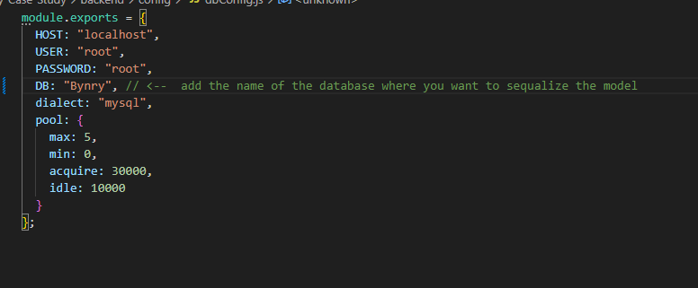

Bynry Case Study Documentation

The main repository contains two folders:
Backend: Contains the backend code.
Frontend: Contains the frontend code.

Starting Backend:
1. Navigate to the backend folder: cd backend.
2. Inside the backend folder, locate the config folder which contains the middleware for the database connection.
3. Adjust the credentials in the config.js file according to your local MySQL database:

4. Run the backend server by typing npm run server in the terminal.
5. The server should now be running. Node.js version used: v20.11.0.

Starting Frontend:

1. Ensure you have Flutter installed, version details:
2. Version : Flutter 3.16.6  • Dart 3.2.3 • DevTools 2.28.4
3. Resolve all dependencies by running flutter pub get.
4. Connect a physical Android device with USB debugging enabled, or set up an Android emulator.
5. Navigate to the hamburger section in VS Code and go to Run -> Run without debugging, or type flutter run in the terminal.

Functionalities Added:

Backend:
1. Complete MVC structured backend.
2. Utilizes MySQL database.
3. Middleware layer for database connectivity.
4. User registration and login based on random OTP.
5. GET API to fetch user data and display it on the frontend homepage.
6. Sequelize and Express are used for ensuring database integrity.

Frontend:
1. State management using GetX.
2. Utilizes both stateless and stateful widgets.
3. Implements Firebase Analytics for insights into the app's usage.
4. Initial plan to display Firebase Analytics specific to the user, but direct API access isn't available.
5. Uses the https package for making requests.
6. Implements a common color palette file for centralized theming.
7. Implements common Snackbar and TextStyle files for consistency.
8. Implements a robust drawer on the landing page, along with tab navigation for the homepage (may have minor layout issues to resolve).